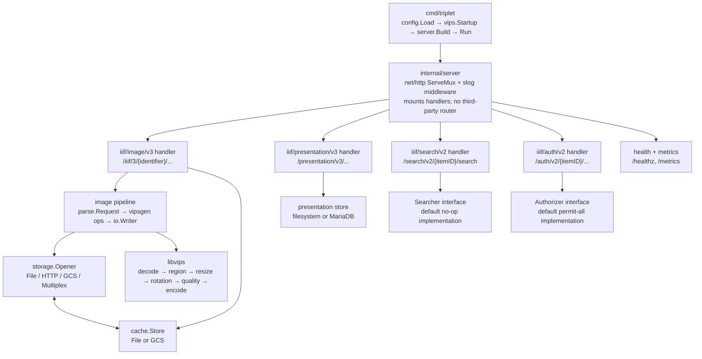

# triplet architecture & status

A Go IIIF server intended to replace two production systems for libops:

1. **Cantaloupe** in the Islandora stack — the IIIF Image API surface that
   accepts URL-as-identifier requests and returns transformed images.
2. **Scribe's `internal/imageservice` and `internal/annotationserver`** —
   Scribe will consume IIIF APIs on triplet directly; no Scribe-specific
   extension routes live on triplet.

This repository is the triplet implementation spike. The goal is to prove
whether libvips + Go can replace Cantaloupe (JVM, OpenJpegProcessor) at lower
memory/cost while remaining spec-compliant, and whether a unified IIIF surface
can serve both the Islandora and Scribe use cases.

## High-level shape

### Why these splits

- **`pipeline` is the only package that talks to vipsgen for transforms.**
  Handlers know nothing about libvips. This keeps the IIIF surface stable
  even if we swap to a different image library later.
- **`storage.Opener` is a single-method interface.** Anything that can produce
  bytes for an identifier (filesystem, HTTP, in-memory upload) plugs in.
  HTTPOpener is what replaces Cantaloupe's `HttpSource` — the identifier
  *is* the URL.
- **`cache.Store` is a single-method interface decorating Openers** and used
  separately for derivative responses. File-backed and GCS-backed today;
  additional backends drop in without touching handlers or pipeline.
- **`internal/vips` owns libvips lifecycle** so no other package calls
  `vips_init`. Per the supply-chain review, `SetLogging` is a global state
  change and only this package is allowed to touch it.

### Why not Connect/buf for IIIF

IIIF is a REST + JSON-LD spec; the URL grammar *is* the contract. Generating
RPC clients adds nothing for IIIF spec routes. Connect remains the right
choice for Scribe's *internal* operations (split/join/crosswalk in the parent
repo's `proto/scribe/v1/`), but those don't belong on triplet — Scribe will
keep that surface in-house and consume only IIIF from triplet.

## Component status

### Done

| Path | What it does | Notes |
|---|---|---|
| `cmd/triplet/main.go` | Entry point: load config → start libvips with configured hardening/tuning → build server → graceful shutdown on SIGTERM. | |
| `internal/config/` | YAML config loader. Strict (`KnownFields=true`), validated. Defaults applied. Supports filesystem, HTTP, and GCS source/cache configuration plus libvips runtime settings. | Tests: ✓ |
| `internal/observability/` | `slog` setup (json/text), request-id middleware, panic recovery. | |
| `internal/metrics/` | Prometheus metrics endpoint and middleware. Exposes HTTP counters/histograms plus libvips memory/file gauges at `/metrics`. | |
| `internal/server/` | `net/http` ServeMux composition. Wires handlers, middleware, graceful shutdown. Builds file / HTTP / GCS / multiplex source openers from config, optionally wraps HTTP with source caching, wires derivative cache, mounts `/metrics`, and mounts Image / Presentation / Search / Auth handlers when enabled. | |
| `internal/storage/opener.go` | `Opener` interface + `Meta` + `ErrNotFound`. | |
| `internal/storage/file.go` | `FileOpener` with path-traversal protection. | Tests: ✓ |
| `internal/storage/http.go` | `HTTPOpener` — URL-encoded identifier → fetch with allow-listed hosts, max-bytes cap, redacted error logging, Range-backed seekable reads when upstream supports Range, and tempfile fallback otherwise. | **Cantaloupe HttpSource parity.** Tests: ✓ |
| `internal/storage/gcs.go` | GCS opener using `cloud.google.com/go/storage`, with tempfile-backed seekable reads for the image pipeline. | Tests: ✓ |
| `internal/storage/multiplex.go` | Routes identifiers to backends by prefix or scheme. | Tests: ✓ |
| `internal/storage/caching.go` | `Caching` decorator: memoise upstream fetches via `cache.Store`, with optional stale-while-revalidate refresh for source caches. | Tests: ✓ |
| `internal/cache/cache.go` | `Store` interface + `Noop`. | |
| `internal/cache/file.go` | Filesystem backend. SHA-256-keyed two-level fan-out, mtime LRU eviction bounded by `MaxBytes`. | Tests: ✓ |
| `internal/cache/gcs.go` | GCS-backed cache store using `cloud.google.com/go/storage`. | Tests: ✓ |
| `internal/cache/keys.go` | Canonical derivative cache key from a parsed `parse.Request`. | |
| `internal/iiif/image/v3/parse/` | Full Image API 3.0 URL grammar parser. Region (full/square/pixels/pct), Size (max/^max/w,/,h/w,h/!w,h/pct: with optional ^ upscale), Rotation (with `!` mirror), Quality, Format. | Tests: ✓ comprehensive table-driven. |
| `internal/iiif/image/v3/types/info.go` | Thin aliases/wrappers over `github.com/libops/iiif-spec` generated Image wire types plus `BuildLevel2Info` and Level-2 capability declarations. | Advertises `jpg`, `png`, `gif`, `webp`, `tif`, `jp2`, `pdf`. |
| `internal/iiif/image/v3/schema/` | Small adapter over `github.com/libops/iiif-spec`’s derived Image schema validator. | Triplet no longer owns the Image schema artifact itself. |
| `internal/iiif/image/v3/pipeline/pipeline.go` | `Transform(ctx, req, w)` — vipsgen-backed: decode source, region (clipped), size (with upscale rules and aspect-preserving best-fit), rotation+mirror, quality (color/gray/bitonal), encode (JPEG/PNG/GIF/WebP/TIFF/JP2/PDF). Streams encoded bytes through `vg.NewTarget(io.Writer)` except PDF, which wraps a JPEG stream in a single-page PDF container. | vips-backed tests cover resize, region+rotation, grayscale quality, bitonal thresholding, GIF output, JP2 output, max_output_pixels enforcement, and color-space normalization (including embedded ICC when the test environment exposes a named sRGB profile). |
| `internal/iiif/image/v3/handler/handler.go` | Handler wired to pipeline + derivative cache. Base→info redirect (303), info.json (CORS, profile link header, configured maxArea/maxWidth/maxHeight), image transform with cache hit/miss path, canonical Link header, and derivative `ETag` / `If-None-Match` handling. Derivatives now stream to the response and cache simultaneously instead of buffering the full payload in memory first. | HTTP-surface tests cover info, canonical link, `ETag`, and `304 Not Modified`. |
| `internal/iiif/presentation/v3/types/` | Thin aliases/wrappers over `github.com/libops/iiif-spec` generated Presentation wire types. Keeps constants for the IIIF Text Granularity extension and open local wrappers where upstream schemas do not yet model fields/resources such as `textGranularity`, Collection, Range, and generic Service resources. | Covers the Presentation resources triplet currently serves or stores. |
| `internal/iiif/presentation/v3/validate/` | Structural validation for the Presentation documents triplet currently serves and accepts: manifests and annotation pages, including the Text Granularity extension rules triplet explicitly supports. | Tests: ✓ |
| `internal/iiif/presentation/v3/store/` | `Store` interface plus filesystem-backed and MariaDB-backed manifest / annotation-page storage. Filesystem manifests live at `{root}/{itemID}/manifest.json`; annotation pages at `{root}/{itemID}/canvas/{canvasID}/annotations.json`. | Tests: ✓ |
| `internal/iiif/presentation/v3/handler/` | Presentation API handler. Supports `GET /presentation/v3/{itemID}/manifest`, `GET|HEAD /presentation/v3/{itemID}/canvas/{canvasID}/annotations`, and `PUT /presentation/v3/{itemID}/canvas/{canvasID}/annotations`, with JSON-LD validation and CORS. | Tests: ✓ |
| `internal/iiif/search/v2/types/` | Minimal Content Search API 2.0 response wire types for AnnotationPage and search-result Annotations. | |
| `internal/iiif/search/v2/searcher/` | `Searcher` interface plus default no-op backend. Keeps indexing outside triplet while preserving the IIIF HTTP contract. | |
| `internal/iiif/search/v2/handler/` | Content Search API handler. Supports `GET|HEAD /search/v2/{itemID}/search?q=...` plus CORS preflight, returning an AnnotationPage. | Tests: ✓ |
| `internal/iiif/auth/v2/` | Authorization Flow API 2.0 surface with a pluggable `Authorizer` interface and default permit-all implementation. Supports probe/access/token/logout routes behind config. | Tests: ✓ |
| `internal/vips/` | libvips lifecycle wrapper: `Startup(Config, *slog.Logger)`, `Shutdown()`, `ReadMemStats()`, error wrapping, `NopWriteCloser`, and startup-only operation blocklist wiring. Sets `VIPS_BLOCK_UNTRUSTED=1` when configured. | |
| `github.com/libops/iiif-spec` | External module containing vendored upstream IIIF machine-readable artifacts, derived schemas, OpenAPI documents, and public Go wire-type packages. | Triplet now consumes machine-readable contract artifacts from a versioned upstream dependency instead of owning vendoring/generation tooling locally. |
| `Dockerfile` | Multi-stage build/test/runtime image. Builds libvips 8.18 from upstream source in a Debian bookworm stage, layers the Go toolchain on top for build/test, and reuses that libvips-capable base for runtime. Includes a `test-runner` stage for containerized `go test`. | Verified through the current `make test` path on a Docker-enabled host. |
| `scripts/build.sh` | Containerized build wrapper. Builds the Docker `build` stage and copies `/out/triplet` back to the host so default builds do not require host libvips/pkg-config setup. | Current default build path. |
| `scripts/test.sh` | Containerized test runner. Builds the `test-runner` stage, reuses Go module/build caches via mounted volumes, and joins a Compose MariaDB network when present to enable integration tests. `REQUIRE_INTEGRATION=1` fails fast when MariaDB is absent. | Current default test path; `make test` succeeds. |
| `scripts/test-integration.sh` | Starts the `deploy/compose` stack, waits for MariaDB and Triplet, then runs `scripts/test.sh` with `REQUIRE_INTEGRATION=1` and the HTTP conformance smoke checks. | |
| `scripts/conformance.sh` | Running-server IIIF smoke checks for base redirect, info.json JSON-LD shape, CORS/profile headers, HEAD, JPEG/PNG/PDF derivatives, ETag/304 behavior, syntax rejection, and optional `iiif-validate.py`. | |
| `Makefile` | build / test / test-integration / test-race / test-asan / conformance / lint / generate / docker / clean. `build` delegates to `scripts/build.sh`; `test` and sanitizer variants delegate to `scripts/test.sh`; `test-integration` delegates to the Compose-backed integration script; `conformance` delegates to `scripts/conformance.sh`; `generate` is now only local formatting because spec artifact generation moved to `iiif-spec`. | |
| `config.example.yaml` | Documents the full configuration surface with comments, including derivative cache, optional source cache, and HTTP source examples. | |
| `deploy/cloudrun/{main,variables}.tf` | Multi-region Cloud Run deployment with source/cache buckets, IAM, regional services, serverless NEGs, global HTTPS load balancer, optional managed certificate, and optional HTTP redirect. | |
| `deploy/compose/` | Single-host docker-compose for self-host. Tracks the current image entrypoint, mounts config/images/presentation/cache paths, and applies read-only/no-new-privileges/cap-drop/seccomp hardening. | |
| `.github/workflows/ci.yml` | CI workflow running the Docker-backed `make test`, `make test-asan`, and compose conformance smoke paths against a freshly built runtime image. | |
| `.github/workflows/publish.yml` | GHCR publish workflow for tagged releases. | |
| `LICENSE`, `README.md`, `.gitignore` | MIT (LibOps LLC). | |

### Implemented Scope And Non-Goals

- Image API conformance smoke is implemented in `scripts/conformance.sh`; CI runs it against the compose stack and invokes `iiif-validate.py` when that tool is present.
- Filesystem and GCS are the supported durable object/cache backends. S3/AWS is intentionally out of scope for this spike and must go through an explicit dependency review before any AWS SDK enters the module graph.
- Presentation uses generated `iiif-spec` types where available and open wrappers for schema gaps such as Collection, Range, Service, and extension resources. Machine-readable spec changes belong in `github.com/libops/iiif-spec`, not this repository.
- Presentation storage supports filesystem and MariaDB. Aligning table names with Scribe's final production schema is an integration mapping task, not a missing triplet storage backend.
- Auth and Search expose spec-shaped HTTP surfaces with pluggable interfaces and safe default no-op / permit-all implementations. Concrete OIDC, Solr, OpenSearch, or institution-specific adapters are deployment integrations.
- CGO sanitizer testing is available through `make test-asan` and wired into CI. Container hardening includes read-only runtime, dropped capabilities, no-new-privileges, and a checked-in seccomp profile for Docker-compatible runtimes.

## Configuration model

Single YAML file. No env var overrides. Schema lives in `internal/config/`
and is documented in `config.example.yaml`. Sources, cache backends, and
extension toggles all live under one document so an operator can render it
once at deploy time.

Today supports `sources.default = file|http|gcs`. When multiple source
backends are configured, `internal/server` builds a `storage.Multiplex` that
routes `http://...` and `https://...` identifiers to `HTTPOpener`, `gs://...`
identifiers to the configured GCS bucket opener, while falling back to the
configured default source for everything else. HTTP source caching and
derivative caching can each target either the filesystem or a GCS bucket.
HTTP source caching supports stale-while-revalidate with
`cache.source_stale_after`: stale hits are served immediately and refreshed
in the background.

## Source dependencies

| Dependency | Version | Why | License |
|---|---|---|---|
| `gopkg.in/yaml.v3` | v3.0.1 | YAML config | MIT |
| `github.com/cshum/vipsgen` | v1.3.9 | libvips bindings | MIT |
| `github.com/libops/iiif-spec` | v0.0.1 | Generated IIIF wire types + derived schema validation | MIT |
| `github.com/prometheus/client_golang` | v1.23.2 | `/metrics` endpoint | Apache-2.0 |
| `github.com/go-sql-driver/mysql` | v1.9.3 | MariaDB-backed Presentation store | MPL-2.0 |
| `cloud.google.com/go/storage` | v1.57.2 | GCS-backed cache/source backends | Apache-2.0 |
| `libvips` (system) | 8.18.x | image processing | LGPL-2.1 |

## Production Boundaries

- **HTTPOpener only streams on range-capable upstreams.** Servers that ignore
  Range requests still use a tempfile-backed full fetch fallback.
- **Conformance is split by responsibility.** Triplet owns running-server smoke
  checks; full generated-schema and validator matrices belong in `iiif-spec`.
- **File-cache eviction is filesystem-scanned.** It uses standard sorting over
  candidate entries, which is intentionally simple and appropriate for the
  current file-cache operating model.

## Project Boundary

Triplet's implementation surface is complete for the current spike when this
repository can build, test, run the compose conformance smoke, and expose the
Image, Presentation, Search, and Auth routes described above without
Scribe-specific endpoints.

Cost benchmarking against Cantaloupe and Scribe application rewiring are
downstream validation tasks. They consume triplet's IIIF APIs; they do not add
implementation requirements to this repository unless those clients expose a
specific spec-compliance gap.
