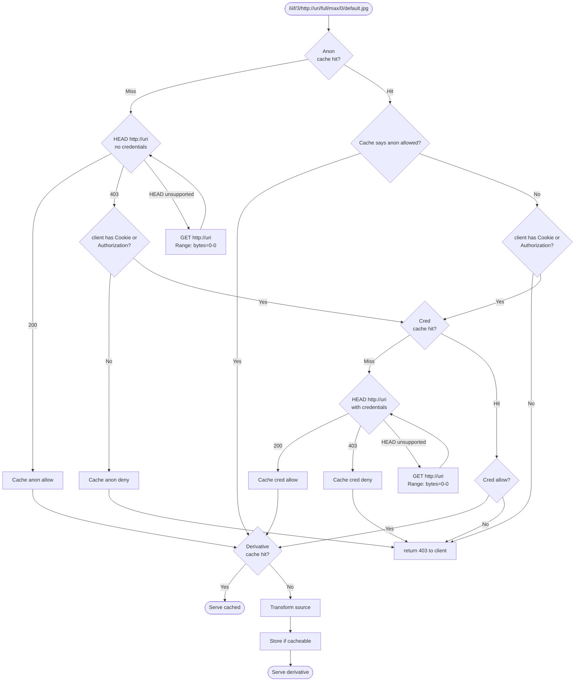

# Authorization

Triplet has a few separate security boundaries:

- Authentication controls identify callers that may use protected administrative
  routes, such as derivative cache invalidation.
- Authorization controls decide whether a request may read an image source or
  use a local-file shortcut.
- Network source boundaries decide which remote HTTP origins Triplet may fetch
  before passing bytes to libvips.

## Authentication Controls

### Cache invalidation route

Derivative caches can be invalidated per identifier by configuring an image
cache invalidation token and calling the protected route:

```yaml
iiif:
  image:
    cache_invalidation_token: ${TRIPLET_IMAGE_CACHE_INVALIDATION_TOKEN}
    cache_invalidation_allowed_cidrs:
      - 127.0.0.1/32
      - ::1/128
```

If `TRIPLET_IMAGE_CACHE_INVALIDATION_TOKEN` is unset,
`TRIPLET_IMAGE_CACHE_INVALIDATION_TOKEN_FILE` may point at a readable mounted
secret file. Triplet reads that file before expanding the YAML configuration and
uses its contents as `TRIPLET_IMAGE_CACHE_INVALIDATION_TOKEN`.

When `cache_invalidation_allowed_cidrs` is set, callers must match one of those
CIDRs in addition to presenting the bearer token. If Triplet runs behind a
reverse proxy, configure `logging.trusted_proxy_cidrs`; only trusted proxies are
allowed to supply the client IP via `X-Forwarded-For` or `X-Real-IP`.

```sh
curl -X POST \
  -H "Authorization: Bearer ${TRIPLET_IMAGE_CACHE_INVALIDATION_TOKEN}" \
  "https://iiif.example.edu/iiif/3/https%3A%2F%2Frepo.example.edu%2Fsystem%2Ffiles%2Fimage.tif/cache/invalidate"
```

The route writes an invalidation marker into the derivative cache. Subsequent
image requests for that identifier use a new cache namespace, so old derivative
objects are ignored even when the source bytes and metadata have not changed.
When the source backend supports per-identifier auth caching, the same route also
clears those cached auth-probe decisions for the identifier.

## Authorization Controls

### Local URL auth probes

Triplet can use the original repository URL as the authority for local file
access. This is useful for deployments where Triplet can read the same files as
Drupal or Fedora, but Drupal remains responsible for deciding who may see them.

Local URL mappings enable the server-side auth probe with `auth_probe: true`:

```yaml
sources:
  file:
    url_mappings:
      - prefix: /system/files
        root: /private
        auth_probe: true
        auth_anonymous_cache_ttl: 720h
        auth_authenticated_cache_ttl: 168h
        auth_error_cache_min_age: 5m
        auth_cache_max_entries: 4096
```

The probe answers whether the original source URL would let this request read
the file. Triplet uses that source response as the authority before serving the
local copy or a cached derivative.

Anonymous access is checked first. If the source allows anonymous access,
Triplet caches that anonymous allow decision for the identifier and all callers
can use it until the TTL expires. If anonymous access is denied and the incoming
request has `Cookie` or `Authorization` headers, Triplet checks the source again
with those headers. Credentialed decisions are cached separately by identifier
and by the exact forwarded `Cookie` and `Authorization` header values, so two
different sessions do not share one authenticated auth decision. A repeated
request with the same headers uses the cached decision until its TTL expires.

Derivative bytes are shared after authorization. The authorization probe or
auth-cache lookup happens before Triplet serves a derivative-cache hit, but the
derivative cache key itself is not per user.



## Source authorization terminology

Triplet's local URL `auth_probe` is a server-side source authorization check. It
is related to, but not the same thing as, an IIIF Authorization Flow API 2.0
`AuthProbeService2`.

IIIF Authorization Flow describes browser-facing services that help a viewer
learn whether a user has access to an access-controlled resource. In IIIF terms,
image responses such as tiles are access-controlled resources, and the cookie,
bearer token, IP address, or other request property used to authorize them is
the authorizing aspect. An `AuthProbeService2` returns an `AuthProbeResult2`
whose `status` is the HTTP status the client should expect if it requested the
access-controlled resource.

Triplet's `auth_probe` uses the same idea internally: before serving a local file
or a cached derivative, Triplet asks the original source URL what status this
request would receive. The source response remains authoritative.

For Triplet's local-file shortcut, the safe optimization is based on the source
authorization result:

- If the source allows anonymous access, Triplet can cache that anonymous allow
  decision for the identifier and all callers can use it until the TTL expires.
- If the source requires an authorizing aspect, Triplet probes with each distinct
  forwarded `Cookie` or `Authorization` value and caches that credentialed
  decision separately.

## Auth decision TTLs

Anonymous and authenticated probe decisions default to 5 minutes. Override them
per mapping with `auth_anonymous_cache_ttl` and
`auth_authenticated_cache_ttl`. If either tier-specific value is omitted,
Triplet falls back to `auth_cache_ttl`. If that is also omitted, the tier uses
the 5 minute default.

Long TTLs are explicit access-staleness windows. They are appropriate when
repository permissions change rarely or when the mapping is used for content
whose access is primarily stable. Shorter TTLs keep permission changes visible
sooner at the cost of more probes to the upstream Drupal URL.

Triplet caches successful probes, 401, 403, and 404 responses for the
configured TTL. Other upstream errors are not cached.

Negative auth-probe caching is conservative. For 401, 403, and 404 probe
responses, Triplet checks the upstream `Last-Modified` header before caching the
denial. If `Last-Modified` parses and is newer than
`now - auth_error_cache_min_age`, the denial is not cached. This avoids holding a
stale denial while repository access rules or file publication are still
settling. If `Last-Modified` is absent, unparseable, or older than that minimum
age window, the denial can be cached for the configured auth TTL.
`auth_error_cache_min_age` defaults to 5 minutes; increase it when repository
metadata and permissions are known to settle more slowly.

`auth_cache_max_entries` defaults to 4096 entries when omitted.

The image cache invalidation route also clears matching auth-probe entries when
the source backend supports it.

## Source Fetch Boundary

When using HTTP identifiers, Triplet treats the identifier as a source URL and
fetches it before passing bytes to libvips.

The HTTP host allowlist prevents arbitrary URL fetches, constrains redirect
targets, and keeps the native image parser surface limited to trusted
repositories. Keep `sources.http.allowed_origins` to the exact upstream origins
Triplet is allowed to fetch, including scheme and port when needed.

An empty list denies all HTTP sources and wildcards are rejected. Private,
loopback, link-local, and metadata addresses are blocked unless
`sources.http.allow_private_hosts` is explicitly enabled. When private hosts are
blocked, Triplet resolves the hostname once and connects only to a verified
public IP, so DNS rebinding cannot swap the connection target after validation.

```yaml
sources:
  http:
    allowed_origins:
      - https://repository.example.edu
    allow_private_hosts: false
    request_timeout: 2m
    max_bytes: 50MiB
```
